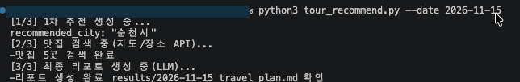
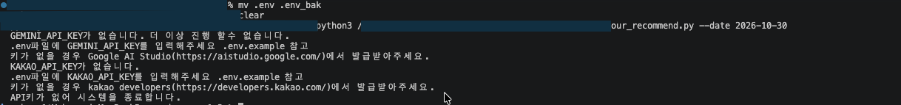
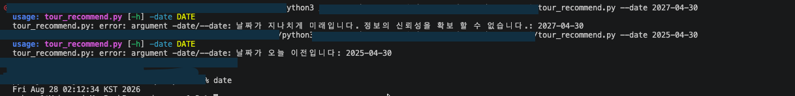
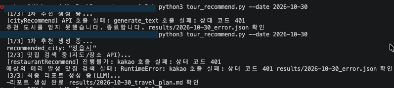
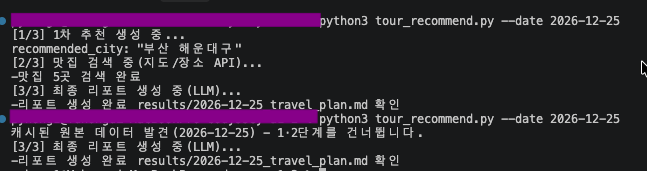
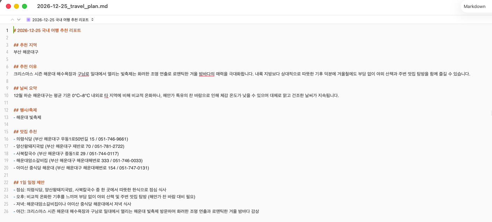
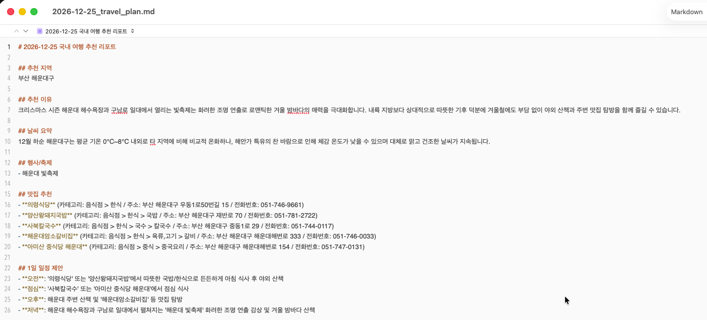

# A1-2: LLM + 지도 API 국내 여행지 추천 CLI

여행 날짜를 입력하면 Gemini API와 Kakao Local API를 조합해 국내 여행 리포트를 생성하는 커맨드라인 프로그램이다.

## 동작 개요

```
--date 입력 → [1] Gemini 1차 추천(JSON) → [2] Kakao Local 맛집 검색 → [3] Gemini 최종 리포트(Markdown)
```

| 단계 | 하는 일 | 출력 |
|---|---|---|
| 1 | 해당 시기에 여행하기 좋은 국내 도시를 JSON으로 추천 | `recommended_city`, `weather`, `events`, `reason` |
| 2 | 1단계의 `recommended_city`로 맛집 5곳 검색 | `food_list` |
| 3 | 1·2단계 결과를 종합해 마크다운 리포트 생성 | `report` |

1단계 프롬프트에서 추천 도시를 **시/군/구 단위**로 제한한다. "강원도" 같은 광역 단위가 나오면 2단계 검색 품질이 떨어지기 때문에, 코드가 아니라 입력 단계에서 정규화한다.

## 실행 방법

```bash
pip install -r requirements.txt
python3 tour_recommend.py --date 2026-11-15
```

`-date`(하이픈 1개)와 `--date`(하이픈 2개) 모두 동작한다.

### 성공 실행



```
[1/3] 1차 추천 생성 중...
recommended_city: "순천시"
[2/3] 맛집 검색 중(지도/장소 API)...
-맛집 5곳 검색 완료
[3/3] 최종 리포트 생성 중(LLM)...
-리포트 생성 완료 results/2026-11-15_travel_plan.md 확인
```

## API 키 설정 방법

1. `.env.example`을 복사해 `.env`를 만든다.

   ```bash
   cp .env.example .env
   ```

2. 아래 두 값을 채운다.

   | 키 | 발급처 |
   |---|---|
   | `GEMINI_API_KEY` | [Google AI Studio](https://aistudio.google.com/) |
   | `KAKAO_API_KEY` | [Kakao Developers](https://developers.kakao.com/) > 내 애플리케이션 > 앱 키 > **REST API 키** |

3. 선택 항목: `TEXT_MODEL`(기본 `gemini-3.6-flash`), `TEXT_MODEL_FALLBACK`(기본 `gemini-3.5-flash`), `BASE_URL`

키가 설정되지 않으면 프로그램이 **즉시 종료**하며, 어떤 키가 빠졌는지와 발급 방법을 안내한다.



### API 키 유출 방지

- 키는 `.env` 또는 환경변수로만 읽는다. 코드에 하드코딩하지 않는다.
- `.env`는 `.gitignore`에 등록되어 있다.
- **외부 API의 에러 응답 본문을 결과물에 저장하지 않는다.** Kakao는 401 응답 메시지에 요청에 사용된 앱 키를 그대로 되돌려주기 때문에, 응답 본문을 `errors`에 담으면 결과 파일에 키가 남는다. 그래서 `errors`에는 상태 코드만 기록한다.
- 키가 노출됐다면 발급처에서 즉시 재발급한다.

## 입력 검증

`--date`는 argparse의 `type=` 검증 함수에서 처리한다. 검증을 인자 정의에 붙여두면 `main()` 본문은 "날짜는 이미 유효하다"를 가정하고 시작할 수 있다.

| 조건 | 처리 |
|---|---|
| `YYYY-MM-DD` 형식 아님 | usage 출력 후 종료 |
| 오늘 이전 | usage 출력 후 종료 |
| 오늘 + 180일 초과 | usage 출력 후 종료 (정보 신뢰성 확보 불가) |



## 결과물 확인 방법

모든 산출물은 `results/` 아래에 `{날짜}_` 접두어로 저장된다.

| 파일 | 내용 |
|---|---|
| [`2026-11-15_travel_plan.md`](./results/2026-11-15_travel_plan.md) | 최종 리포트 (마크다운) |
| [`2026-11-15_raw_data.json`](./results/2026-11-15_raw_data.json) | 파이프라인 전체 결과 + `errors` |
| [`2026-11-15_cityRecommend.json`](./results/2026-11-15_cityRecommend.json) | 1단계 LLM 응답 원본 |
| [`2026-11-15_finalReport.json`](./results/2026-11-15_finalReport.json) | 3단계 LLM 응답 원본 |
| `{날짜}_error.json` | 실패가 있을 때만 생성 |
| `{날짜}_warning.jsonl` | 폴백 모델 사용 등 운영 로그 |

### 최종 리포트 예시

```markdown
# 2026-11-15 국내 여행 추천 리포트

## 추천 지역
순천시

## 추천 이유
...

## 날씨 요약
...

## 행사/축제
- 순천만갈대축제

## 맛집 추천
- 의령식당 (부산 해운대구 우동1로50번길 15 / 051-746-9661)
...

## 1일 일정 제안
- 오전: ...
- 오후: ...
- 저녁: ...
```

## 에러 처리 정책

실패를 두 축으로 나눈다 — **재시도 가능한가**와 **파이프라인을 중단하는가**. 두 축은 독립이다.

| 상황 | 재시도 | 파이프라인 |
|---|---|---|
| API 키 미설정 | 불가 | **즉시 종료** |
| LLM JSON 파싱 실패 / 필수 키 누락 | **1회** (프롬프트 수정 후 재요청) | 재시도까지 실패하면 종료 |
| Gemini 429/500/503 | 폴백 모델로 1회 | 계속 |
| 지도 API 인증 실패(401/403) | 불가 | **계속** — 맛집을 "데이터 없음"으로 표기 |
| 지도 API 검색 결과 0건 | 해당 없음 | 계속 |
| 맛집 항목 필수 필드 누락 | 해당 없음 | 해당 항목만 제외하고 계속 |

401/403은 키나 권한 설정이 잘못된 것이므로 다시 요청해도 같은 결과가 나온다. 재시도해도 소용이 없다는 점에서는 키 미설정과 같지만, 처리가 정반대인 이유는 **없이도 리포트를 만들 수 있는 정보인가**가 다르기 때문이다. 키가 없으면 아무것도 못 하지만, 맛집이 없어도 도시·날씨·행사·일정은 나온다.

### 재시도 프롬프트

JSON 파싱이나 필수 키 검증에 실패하면, 원래 프롬프트에 다음을 덧붙여 한 번만 재요청한다.

```
이전 응답이 올바르지 않았습니다. 다음 키를 모두 포함한 JSON 객체 하나만 출력하세요: recommended_city, weather, events, reason
```

필수 키 목록은 호출부가 `run_stage`에 인자로 넘기므로, 스테이지마다 다른 키를 요구할 수 있다. 재시도 상한은 `for i in range(2)`로 코드에 고정되어 있어 무한 재시도가 발생하지 않는다.

### 실패 시 동작



- **위**: Gemini 키가 잘못되어 1차 추천 실패 → 즉시 종료
- **아래**: Kakao 키가 잘못되어 맛집 검색 실패 → 리포트는 정상 생성, `## 오류 요약(errors)` 섹션에 기록

실패 내역은 `errors` 리스트에 누적되어 세 곳에 반영된다.

1. 터미널 출력
2. `{날짜}_raw_data.json`의 `errors` 필드
3. 최종 리포트 끝의 `## 오류 요약(errors)` 섹션

오류 요약 섹션은 LLM이 아니라 **코드가 직접 렌더링한다.** 오류 기록은 사실이므로 요약하거나 윤색되면 디버깅 정보가 사라지고, LLM 호출 실패를 보고하기 위해 LLM을 다시 부르는 구조는 실패 상황에서 함께 무너진다.

## 보너스: 결과 캐싱

같은 `--date`로 재실행하면 저장된 `{날짜}_raw_data.json`을 재사용해 **1·2단계 API 호출을 건너뛴다.**



3단계는 캐시가 있어도 항상 실행한다. 프롬프트를 수정해가며 리포트 품질만 반복 개선할 수 있기 때문이다. 아래는 같은 캐시로 두 번 생성한 리포트다.

| 첫 실행 | 재실행 |
|---|---|
|  |  |

추천 지역·날씨·행사·맛집 목록은 캐시에서 그대로 오지만, 맛집 표기 형식과 일정 구성(3단 → 4단)이 달라졌다. 1·2단계 데이터는 고정된 채 3단계 출력만 바뀐 것이 확인된다.

캐시를 무시하고 처음부터 실행하려면 `results/{날짜}_raw_data.json`을 삭제한다.

## 설계 메모

### GET / POST

| 호출 | 메서드 | 이유 |
|---|---|---|
| Kakao Local 키워드 검색 | GET | 조회. 같은 키워드는 같은 결과이고 서버 상태를 바꾸지 않는다 |
| Gemini `generateContent` | POST | 생성 요청. 같은 프롬프트도 매번 다른 결과가 나오고 토큰이 차감된다. 프롬프트 길이가 URL 길이 제한을 넘길 수도 있다 |

### LLM 출력을 JSON으로 강제한 이유

자유 텍스트를 받으면 다음 단계에서 도시명을 뽑아내기 위해 문자열 파싱이 필요하고, 표현이 바뀔 때마다 깨진다. `responseMimeType: application/json`으로 형식을 강제하고 필수 키를 코드에서 검증하면, 2단계 입력이 항상 같은 모양으로 들어온다.

### 지도 API 교체 범위

Kakao를 다른 제공자로 바꿀 때 수정하는 함수는 `search_places()` 하나다. 이 함수는 API 응답에서 필요한 항목을 꺼내 `list[dict]`로 돌려주고, 호출부는 그 형태만 알고 있다. 실패는 예외로 던지고 기록은 호출부가 담당하므로, 함수 자체는 파일 경로나 `errors`를 알 필요가 없다.

### 파일 구성

| 파일 | 책임 |
|---|---|
| `tour_recommend.py` | 인자 파싱, 파이프라인 배선, 결과 저장 |
| `gemini_provider.py` | Gemini 호출 계층. 모델 폴백 포함 |
| `prompts/*.txt` | 단계별 프롬프트 템플릿 (`{{입력}}` 자리표시자) |

프롬프트를 코드에서 분리해 `prompts/`에 두면, 프롬프트를 고칠 때 코드를 건드리지 않는다.

## 알려진 한계

- `events`(행사/축제)는 LLM 추론 결과이며 외부 데이터로 검증하지 않는다. 다른 필드와 달리 실재를 확인할 경로가 없으므로 방문 전 확인이 필요하다.
- 일정 제안은 맛집 데이터만 참조한다. 관광지 데이터가 없어 시간대별 활동이 일반적인 서술에 머무를 수 있다.
- 캐시는 날짜 기준이다. 도시 기준으로 맛집을 캐시하면 키 공간이 작고 데이터가 시간 불변이라 히트율이 높지만, 단발 CLI 실행에서는 같은 날짜 재실행이 유일한 반복 패턴이므로 날짜를 키로 선택했다.
